

<h1>Introduction:</h1>

In this code pattern we will help to create a Watson Visual Recognition Image training app that leverages the IoT Platform. 
We will be using Watson's below services:

1. Speech To Text(STT)
2. Text To Speech(TTS)
3. Visual Recognition(VR)
4. Watson IoT
5. Cloudant NoSQL storage service

For quick intro see <a href="src/extresources/images/intro.mp4">this video</a>

This code pattern consists of below two applications:
1. Training App(to create and train a new custom classifier using Watson's VR)
2. Prediction App(to demonstrate the prediction results of each image through created custom classifier including default one.)

Watson Visual Recognition Image training app is standalone java based application which can be run independently on device which has valid jre installed such as MacBook or any linux/Windows based operating system.

<h1>Architecture:</h1>

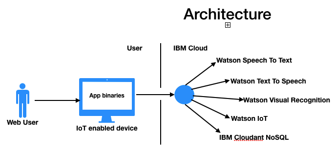

After completing this journey you will understand how to:

a. Train VR classifier to detect an object in an image. 
b. Recognize speech using Speech To Text(EN) service of Watson. 
c. User friendly interaction by playing WAV stream received by calling Text to Speech. 
d. Store Images on cloud using IBM Cloud Cloudant DB service.  
e. Leverage the IBM Cloud IoT platform.  

<h1>Dependencies:</h1>

Note: this app has been tested on MacBook with below versions:
1. java version "1.8.0_121"
2. Apache Maven 3.2.5
3. Zip 3.0

<h1>Pre Requisite:</h1>

1. goto the IBM Cloud catalog home page and under "Apps" select "Boilerplates".
2. click "Internet of Things Platform Starter".
3. Enter app name and other required inputs and click "create" button.
4. This will create below three IBM Cloud service instances for you to start with IoT stuff:
	* Node-Red JS sdk
	* IoT Platform service
	* Cloudant NoSQL DB service.   
		Your newly created app instance will look like below:
		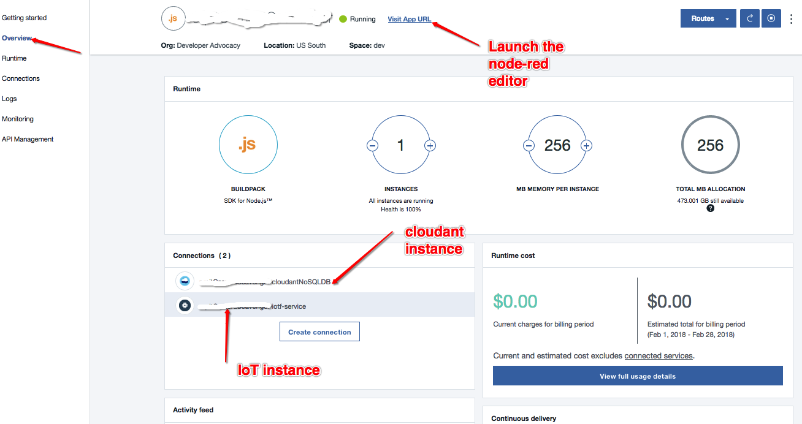
5. get the credentials for below services, we will be updating them in a ".properties" file in few further steps: 
	a. Speech to Text 
	b. Text to Speech 
	c. Visual Recognition 
	d. IoT (created in previous step) 
	e. Cloudant NoSQL(created in previus step) 
	
Note: You can mannually add your precreated Watson services as shown below by clicking to "Connections" in left menu panel.
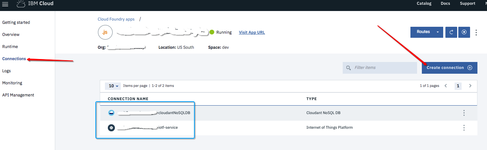

<h1>Before you begin:</h1> 

<h1>a. Register your IoT device on WatsonIoTPlatform:</h1> 

	1. goto your Bluemix services catalog and click IOT-service created in previous step.
	2. On this page you will see Launch button, click this. 
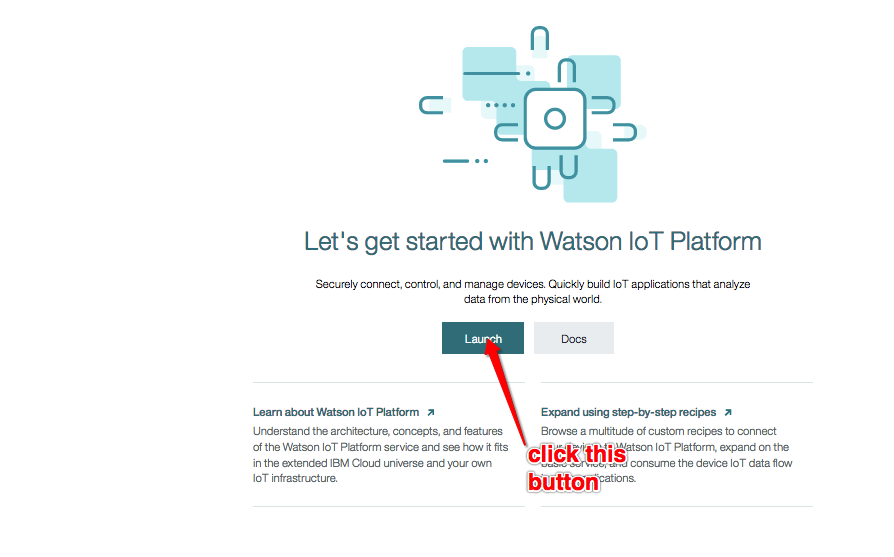

	3. This will open saperate IBM Watson IoT Platform home page for your service.
	
	4. Select DEVICES option in left menu panel.
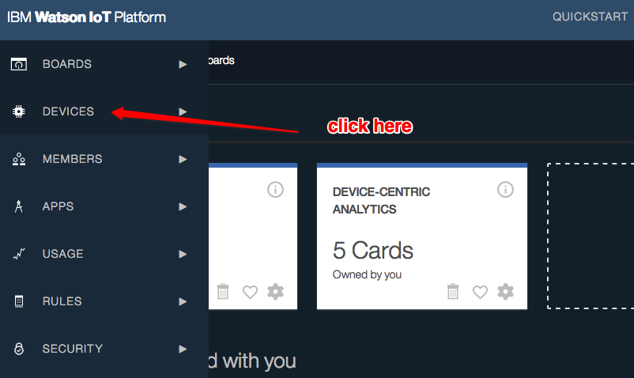

	5. In order to register your device first you must have a device type to be created. If you have already created device type you can skip this step.
	
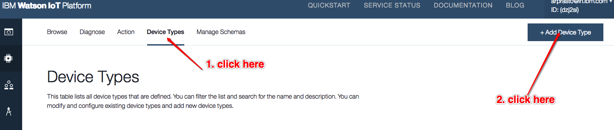
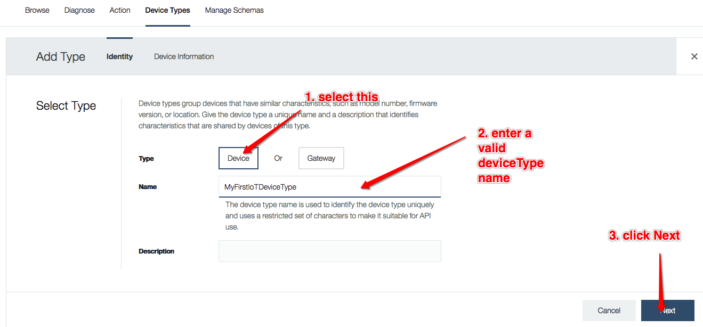
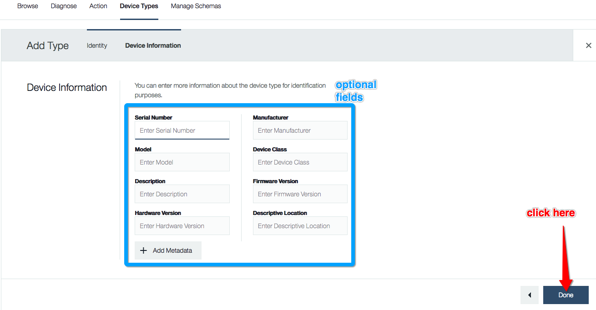

	6. To add & register a new device follow steps(3 till 11) mentioned here: https://console.bluemix.net/docs/services/IoT/iotplatform_task.html#iotplatform_task' or alternatively you can take reference from below screen shots:
	
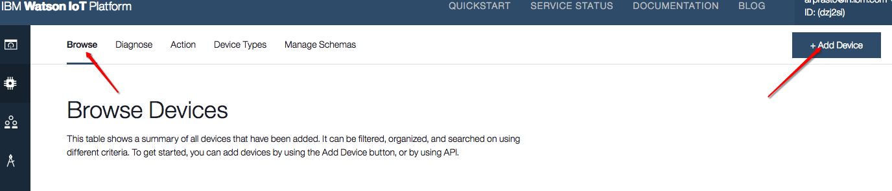
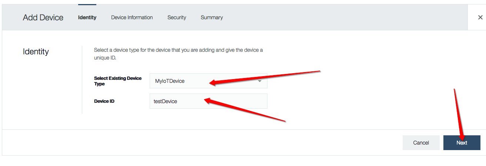
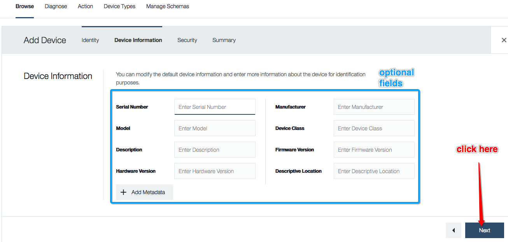
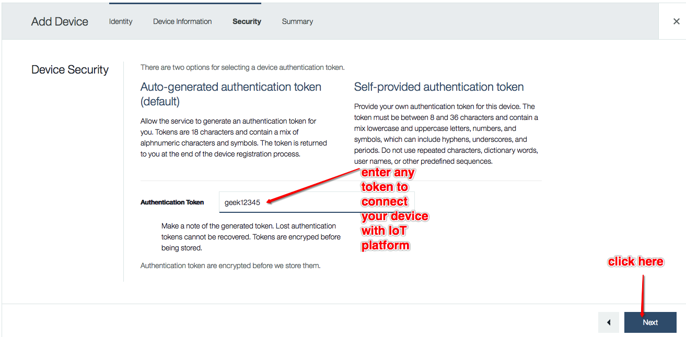
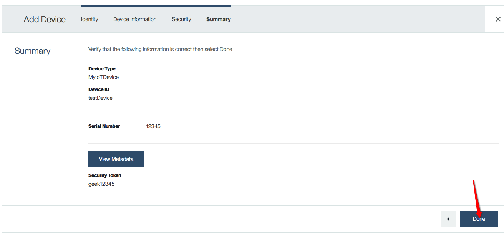
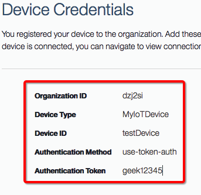

	5. Once you register your device update below into your .properties file which we will create in next step:

		Organization ID xxxx
		Device Type xxxxx
		Device ID xxxxx
		Authentication xxxxxx
		Authentication Token xxxxxx

<h1>b. create Node-Red device simulator to receive events/send notification back to IoT device.</h1>

	1. goto the home page of boilerplate app created in Pre Requisite steps.
	2. click "overview" menu option in left page panel.
	3. on current page you will see "Visit App URL" hyper link. This will load your Node-Red editor in saperate page.

	
	Note: execute below steps 4 and 5, if you don't have the base-64 node plugin else continue from step-6 
	
	4. On this Node Red editor page click menu -> Manage Palette -> Install. 
	5. Type "base64" in search text box and install "node-red-node-base64" node plugin.
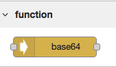
	
	6. Again, on Node Red editor page click menu on top right corner and select 'Import' -> 'Clipboard'.
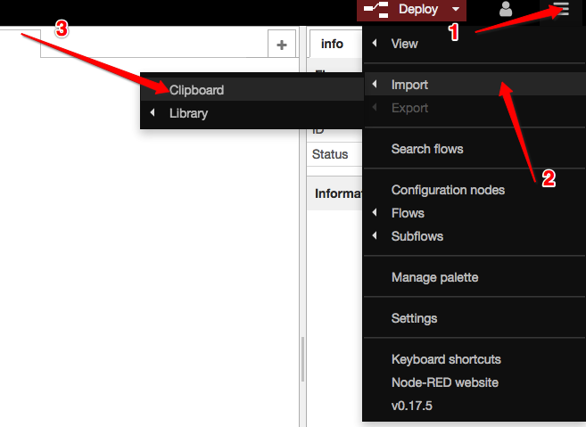

	7. In pop up input dialog copy and paste from NodeRedJsIoTReciever.json file attached with this code base.
	8. Double click on below highlighted Nodes and cross check your created services instance details:
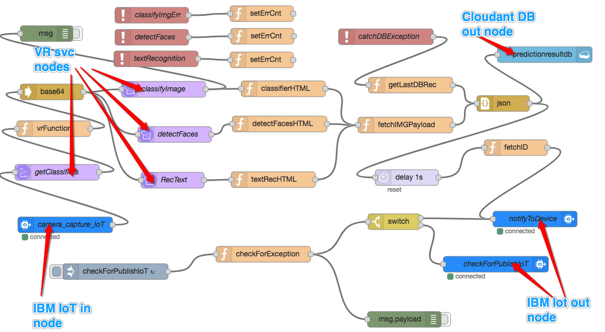
	
	8. Click on 'Deploy' button. 

<h1>How to build and run it:</h1>

1. Clone this application code into your local env using 'git clone <git-URL>'
2. Create an ".properties" file similar to "sample-properties.properties" provided.
3. Update Watson IBM Cloud credentials in for each service in this created ".properties" file.
3. Run the maven build through 'mvn clean package'. This will create 3 jars(one with dependencies, one with app code binaries and one containing both(WatsonVRTrainingApp-0.0.1-jar-with-dependencies.jar))
4. Main class to start any of above mentioned app is com.ibm.watson.WatsonVRTraining.LaunchApp. 

You can run any of below application:

a. Running the Training app

	1. Run the below java command on your shell prompt:
	java -cp ${work_dir}/target/WatsonVRTrainingApp-0.0.1-jar-with-dependencies.jar com.ibm.watson.WatsonVRTraining.LaunchApp .properties trainApp
	2. Please listen to the announce message from the STT service and following its instructions to create a custom image classifier using launched java web cam.  
	3. After creating the classifier this app will automatically exit.

b. Running the Prediction app

	1. Run the below java command on your shell prompt:
	java -cp ${work_dir}/target/WatsonVRTrainingApp-0.0.1-jar-with-dependencies.jar com.ibm.watson.WatsonVRTraining.LaunchApp .properties predictionApp
	2. To start the prediction app your voice will be recognized through Watson STT service to recognize any of key word like:'prediction app' or 'result app'.
	2. This will connect your device to Watson IoT and captured images will be stored in configured CLOUDANT DB.
	3. To exit from this app your voice will be recognized through Watson STT service to recognize any of key word: 'exit' or 'i am done' or 'i'm done'.